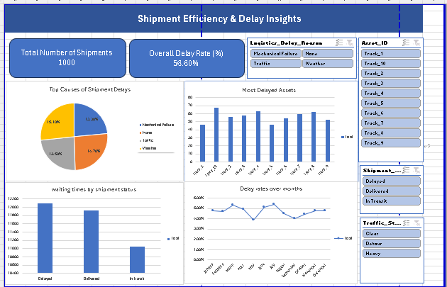

# 📦 Logistics Delay Analysis Dashboard

This project provides an interactive Excel dashboard for analyzing shipment efficiency, identifying delay causes, and evaluating asset performance using a logistics dataset of 1000 shipments.

## 🚀 Project Overview

The goal is to support decision-making in logistics operations by:
- Tracking key performance indicators (KPIs)
- Highlighting delay patterns by truck, time, and reason
- Visualizing the relationship between traffic, weather, and asset utilization

## 📊 Dashboard Features

- **Total Shipments Processed**
- **Overall Delay Rate (%)**
- **Pie Chart** of Top Delay Reasons
- **Bar Chart** of Delays by Asset ID
- **Waiting Time by Shipment Status**
- **Delay Rates Over Months**
- **Interactive Slicers**:
  - Shipment Status
  - Delay Reason
  - Asset ID
  - Traffic Status

## 🛠️ Tools Used

- **Microsoft Excel**
  - Pivot Tables
  - Slicers
  - Power Query
  - Charts (Bar, Pie, Line)

## 📌 Insights Gained

- **56.6%** of shipments were delayed, primarily due to **Traffic**.
- Some trucks (e.g., `Truck_2`, `Truck_10`) had the highest delay counts.
- Waiting time was similar across statuses, suggesting other delay causes.
- Seasonal trends may influence performance.

## 📝 How to Use

1. Open the `smart_logistics_dataset.xlsx` file in Excel
2. Use the slicers to explore different filters (e.g., specific truck, delay reason)
3. Review visualizations and KPI summaries

## 📜 License

This project is licensed under the MIT License – see the [LICENSE](LICENSE) file for details.

## 📸 Dashboard Preview

